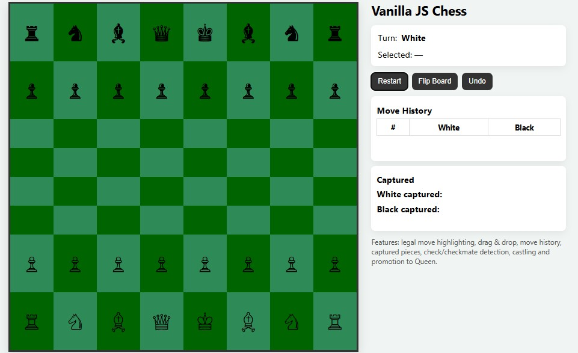
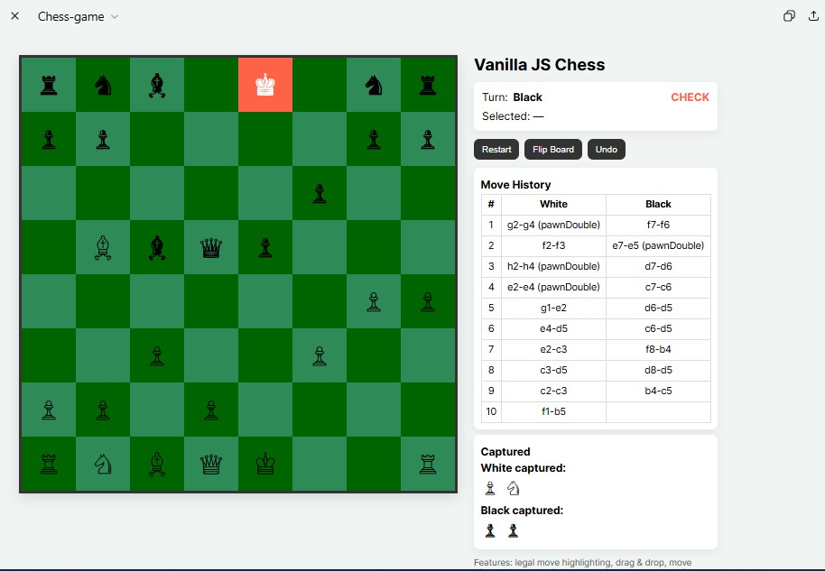
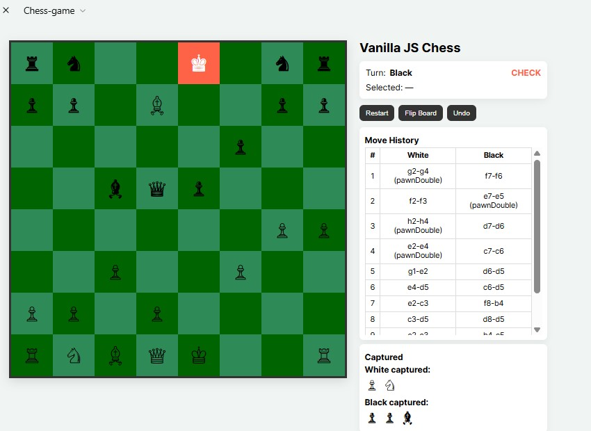
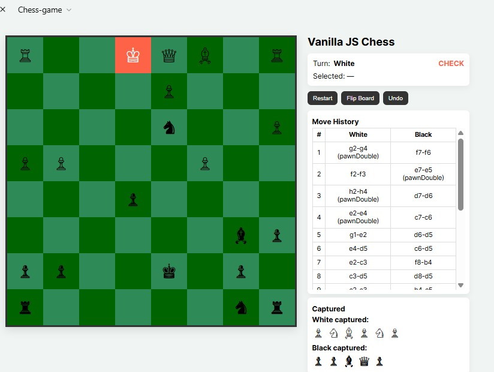
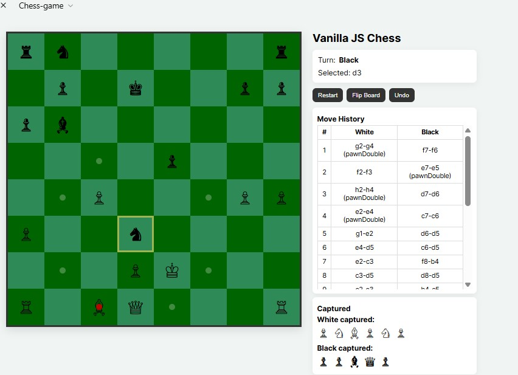
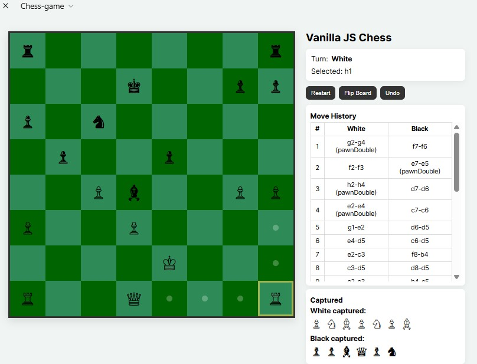
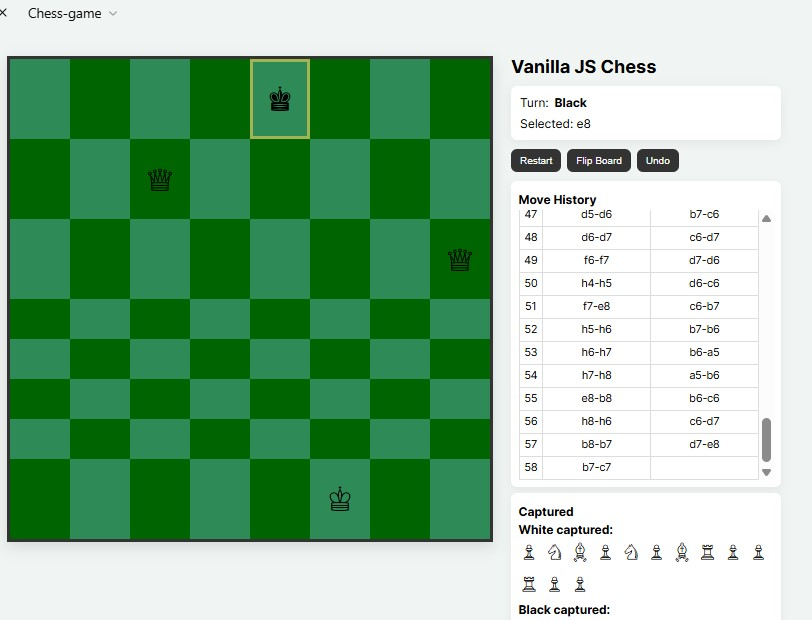
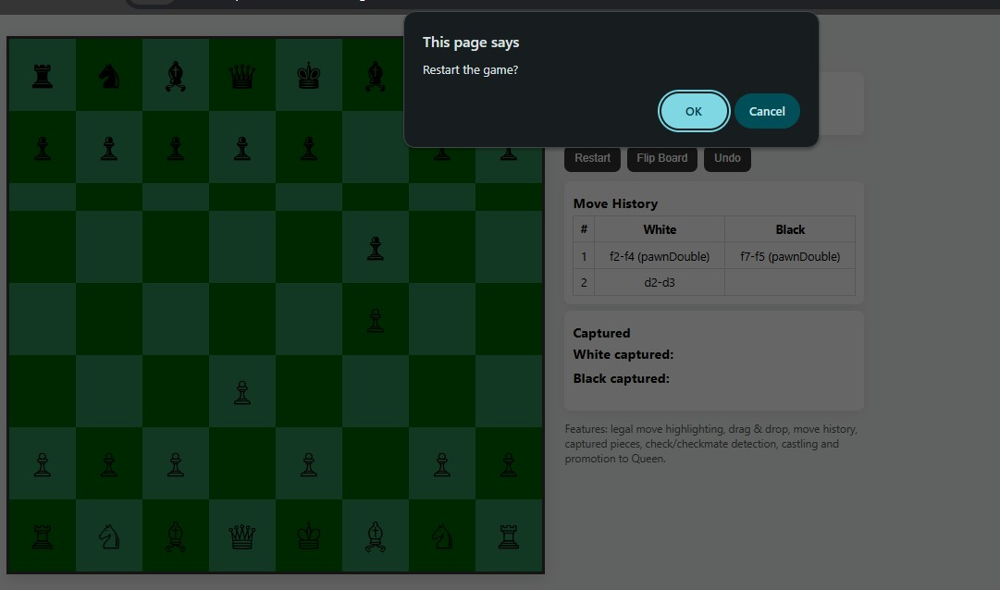

# EUTechFifthProject
# Vanilla JS Chess

An interactive **2-player chess game** built with **HTML, CSS, and JavaScript.  
No servers or backend required — everything runs locally in your browser.

Features

- Dynamic 8x8 chessboard (dark green/royal green theme)
- Full chess rules:
  - Legal moves per piece
  - Turn switching
  - Check & checkmate detection
  - Castling
  - Pawn promotion (to queen)
- Click-to-move **and** drag & drop support
- Legal move highlighting
- Move history (White / Black columns)
- Captured pieces display
- Restart, Flip Board, and Undo buttons
- Responsive design (works on desktop & mobile)

Screenshots
Game Board

Move History

Captured Pieces

Check and Checkmate

Restart Game

---

cd vanilla-js-chess
open chess-game.html   # or double-click in file explorer
